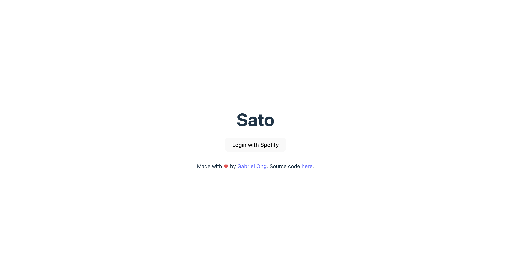
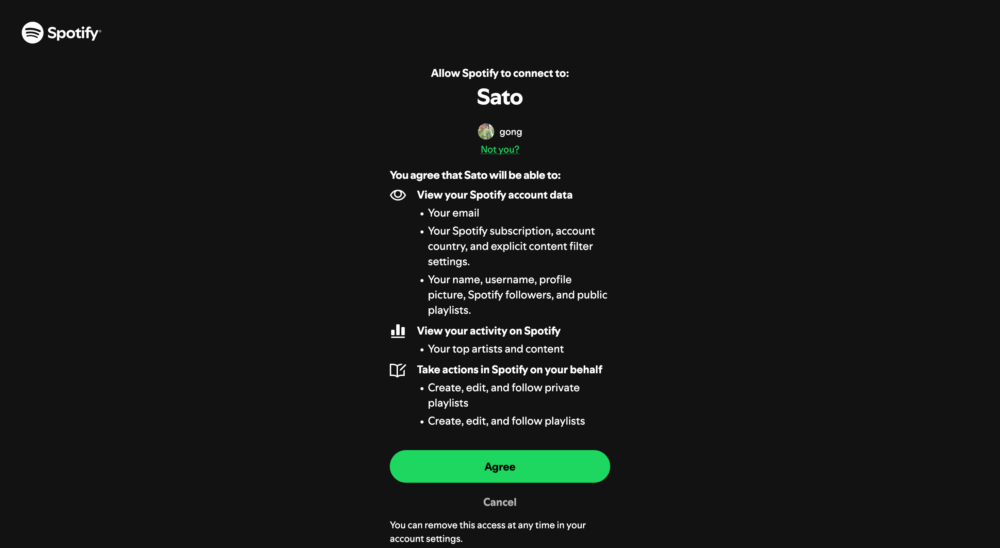
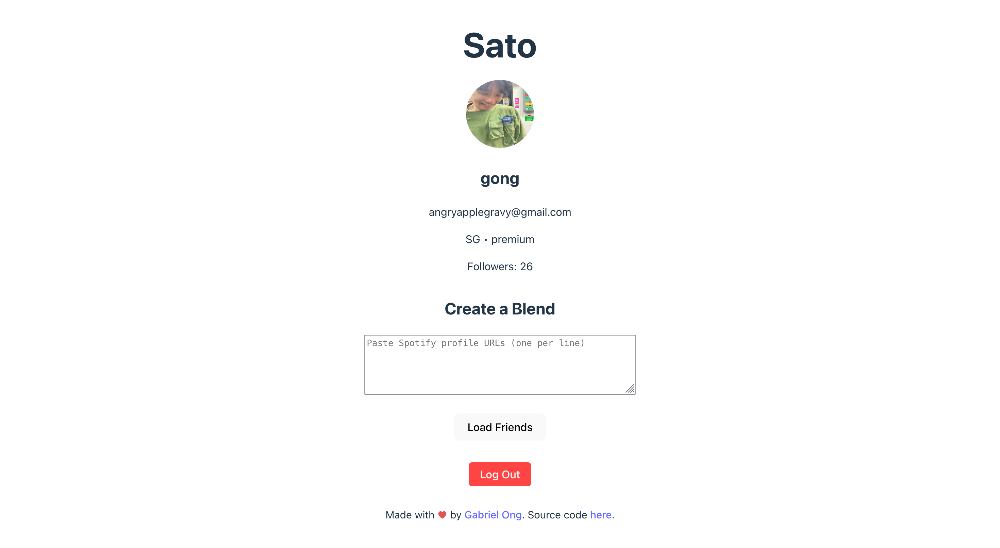
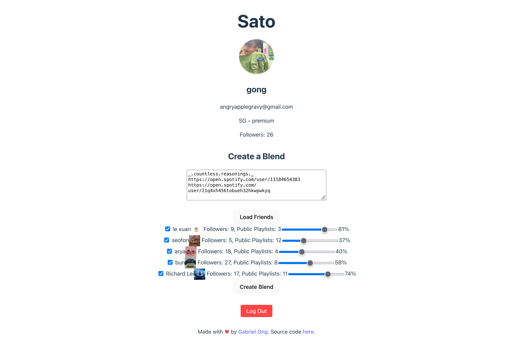
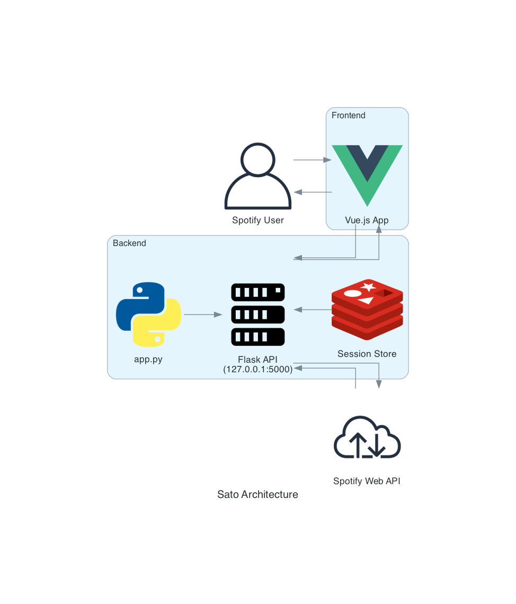

[](https://github.com/gongahkia/sato/releases/tag/1.0.0)

# `Sato`

A Web App that provides fine-grained control over Spotify Blends by wrangling with [their](https://developer.spotify.com/documentation/web-api/concepts/authorization) janky [OAuth 2.0](https://datatracker.ietf.org/doc/html/rfc6749).

## Stack

* *Backend*: [Flask](https://flask.palletsprojects.com/en/stable/), [Redis](https://redis.io/), [Python](https://www.python.org/)
* *Frontend*: [Vue.js](https://vuejs.org/)
* *API*: [Spotify Developer Web API](https://developer.spotify.com/documentation/web-api)
* *Deploy*: [Netlify](https://www.netlify.com/), [Heroku](https://www.heroku.com/)

## Screenshots

### Login with Spotify

<div style="display: flex; justify-content: space-between;">
  
  
</div>

### Paste Spotify Profile URLs

<div style="display: flex; justify-content: center;">
  
</div>

### Create Custom Blends

<div style="display: flex; justify-content: center;">
  
</div>

## Architecture



## Usage

First [register](https://developer.spotify.com/) as a Spotify Developer.

Then *Create app* on the [Spotify Developer Dashboard](https://developer.spotify.com/dashboard) and add **http://127.0.0.1:5000/callback** under *Redirect URIs*.

Create an `.env` file with the *Client ID* and *Client secret*.

```env
SPOTIFY_CLIENT_ID=XXX
SPOTIFY_CLIENT_SECRET=XXX
```

Then run the below.

```console
$ git clone https://github.com/gongahkia/sato
$ cd backend && python3 -m venv myenv && source myenv/bin/activate
$ cd backend && pip install -r requirements.txt && python3 app.py
$ cd sato-app && npm install && npm run dev
```

* See the frontend at [127.0.0.1:5000](http://127.0.0.1:5000/).  
* See the backend at [localhost:5000](http://localhost:5000).

## Reference

The name `Sato` is in reference to [Satō](https://ajin.fandom.com/wiki/Sat%C5%8D) (佐藤), the chief antagonist who opposes [Kei Nagai](https://ajin.fandom.com/wiki/Kei_Nagai) in the completed manga series [Ajin](https://ajin.fandom.com/wiki/Ajin_Wiki).

