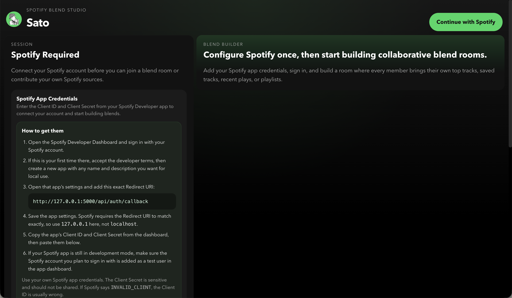
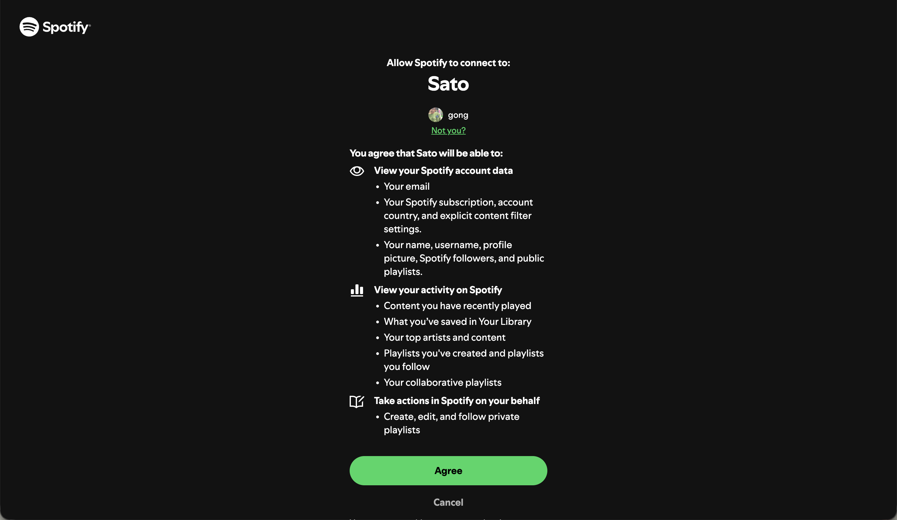
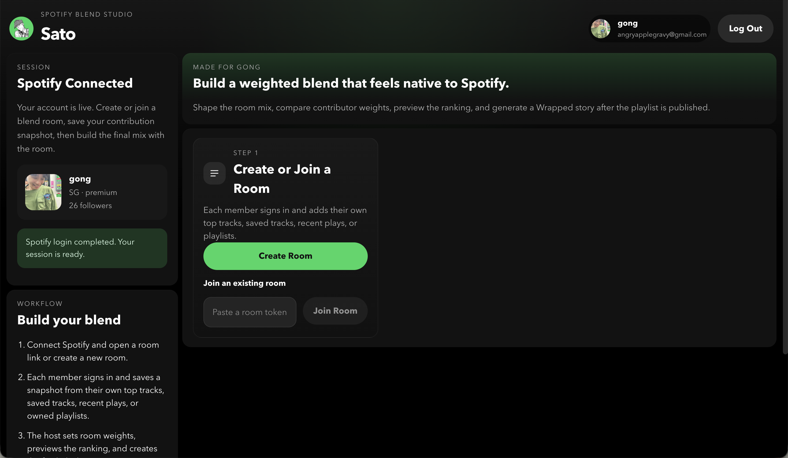
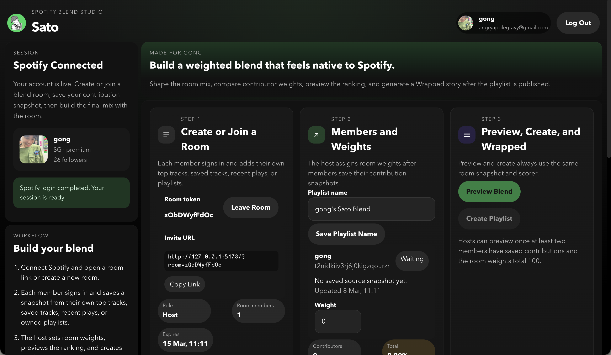
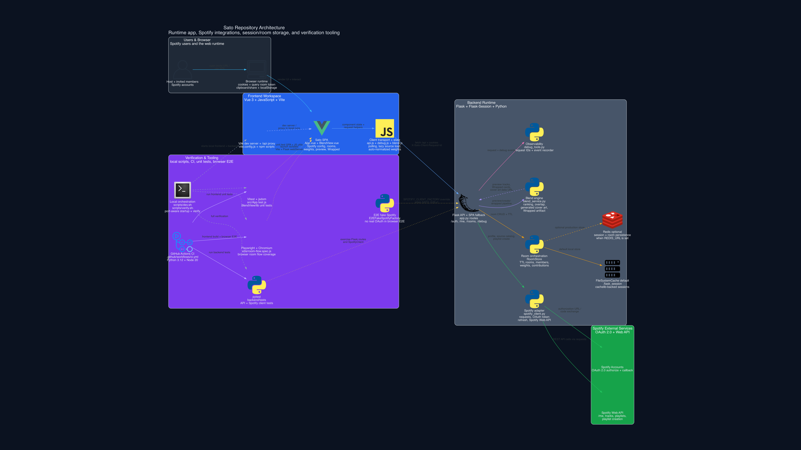

[](https://github.com/gongahkia/sato/releases/tag/1.0.0)
[](https://github.com/gongahkia/sato/releases/tag/2.0.0)


# `Sato`

Web app for building collaborative [Spotify Blends](https://community.spotify.com/t5/FAQs/Blend-playlists-Overview/ta-p/5246498) with [host-managed weights](#architecture) and [custom Blend Wrapped recaps](#architecture).

## Stack

* *Frontend*: [Vue.js](https://vuejs.org/), [Vite](https://vite.dev/), [JavaScript](https://developer.mozilla.org/en-US/docs/Web/JavaScript), [face-api.js](https://github.com/justadudewhohacks/face-api.js)
* *Backend*: [Python](https://www.python.org/), [Flask](https://flask.palletsprojects.com/en/stable/), [Flask-Session](https://flask-session.readthedocs.io/en/latest/), [cachelib FileSystemCache](https://cachelib.readthedocs.io/en/stable/), [Redis](https://redis.io/)
* *Desktop*: [Go](https://go.dev/), [Bubble Tea](https://github.com/charmbracelet/bubbletea), [Cobra](https://github.com/spf13/cobra), [OpenCV](https://opencv.org/), [DeepFace](https://github.com/serengil/deepface), [mpv](https://mpv.io/)
* *Auth*: [OAuth 2.0](https://oauth.net/2/), [PKCE](https://oauth.net/2/pkce/)
* *API*: [Spotify Developer Web API](https://developer.spotify.com/documentation/web-api), [ytmusicapi](https://github.com/sigma67/ytmusicapi)
* *Data*: [SQLite](https://www.sqlite.org/)
* *Testing*: [pytest](https://pytest.org/), [Vitest](https://vitest.dev/), [Playwright](https://playwright.dev/)
* *CI/CD*: [GitHub Actions](https://github.com/features/actions)

## Screenshots






## Usage

The below instructions are for locally hosting `Sato`.

1. First register as a Spotify Developer [here](https://developer.spotify.com/) and create an app on the [Spotify Developer Dashboard](https://developer.spotify.com/dashboard). 

2. Next, run the below to install `Sato` and its dependancies.

```console
$ git clone https://github.com/gongahkia/sato && cd sato
$ python3 -m venv backend/.venv
$ source backend/.venv/bin/activate
$ pip install -r backend/requirements.txt
$ npm --prefix sato-app install
```

3. Finally run the below to begin using `Sato`.

```console
$ ./scripts/dev.sh # starts Sato frontend and backend
$ ./scripts/verify.sh # runs full local verification pass
```

4. To run `Sato Pulse` (mood-driven desktop music player), install the additional dependencies below.

```console
$ cd sato-pulse
$ go build -o sato-pulse ./cmd/sato-pulse
$ cd mood-engine && pip install -e . && cd ..
$ ./sato-pulse configure # interactive config setup
$ ./sato-pulse setup # YouTube Music auth
$ ./sato-pulse # run with TUI dashboard
```

5. To use Spotify as the playback source for `Sato Pulse`, set `SPOTIFY_CLIENT_ID` and update `~/.config/sato-pulse/config.toml`.

```toml
[playback]
source = "spotify"

[spotify]
client_id = "your_spotify_app_client_id"
```

## Architecture



## Other notes

I probably spent 75% of my time wrangling with [Spotify's](https://developer.spotify.com/documentation/web-api/concepts/authorization) janky [OAuth 2.0](https://datatracker.ietf.org/doc/html/rfc6749) implementation and 25% of the time actually developing `Sato`.

*(**Update for Sato v2.0.0**: Spotify's OAuth 2.0 Docs have not improved one bit in the past year. Shit's still ass.)*

## Reference

The name `Sato` is in reference to [Satō](https://ajin.fandom.com/wiki/Sat%C5%8D) (佐藤), the chief antagonist who opposes [Kei Nagai](https://ajin.fandom.com/wiki/Kei_Nagai) in the completed manga series [Ajin](https://ajin.fandom.com/wiki/Ajin_Wiki).


